# Design Document: Product Agent Expansion

## Overview

The Product Agent Expansion transforms the single-file `agents/product-agent.md` into a comprehensive multi-module directory at `agents/product-agent/`. This mirrors the established pattern used by the Architecture Agent (`agents/architect-agent/`), where each product management concern lives in a dedicated markdown file with its own title, responsibility, and operational instructions.

The expanded Product Agent serves as the **source of truth** for the AI-DLC pipeline. It produces machine-readable YAML PRD output consumed by all downstream agents (Architecture, Java, React, Test, DevOps). A Product Review sub-agent validates completeness and consistency before handoff.

### Key Design Decisions

1. **Follow the architect-agent pattern**: Use the same directory + README + module file structure already proven in the codebase.
2. **YAML 1.2 as the machine-readable format**: Standard, well-tooled, human-readable format for inter-agent communication.
3. **Validation as behavioral specification**: Each module's validation rules are expressed as prompt instructions, with a shared validation utility schema that tooling can verify.
4. **Maturity-gated workflow**: Features progress through Idea → Discovery → MVP → Production → Enterprise with enforced exit criteria.
5. **No code generation**: The Product Agent produces only specifications, diagrams, and structured data — never executable code.

## Architecture

```mermaid
graph TD
    subgraph "agents/product-agent/"
        README["README.md<br/>(Entry Point + Master Prompt)"]
        
        subgraph "Core Discovery"
            VM[vision.md]
            BAM[business-analysis.md]
            PM[personas.md]
            RGM[requirements-gathering.md]
        end
        
        subgraph "Story & Criteria Generation"
            USG[user-stories.md]
            ACG[acceptance-criteria.md]
            NFR[nfr.md]
        end
        
        subgraph "Strategy & Planning"
            PRI[prioritization.md]
            RM[roadmap.md]
            CA[competitor-analysis.md]
            RP[release-planning.md]
            BM[backlog.md]
        end
        
        subgraph "Experience & Flow"
            UIX[ui-ux.md]
            WF[workflows.md]
        end
        
        subgraph "Intelligence & Measurement"
            AID[ai-discovery.md]
            AN[analytics.md]
            RA[risk-analysis.md]
        end
        
        subgraph "Output & Quality"
            PRD[prd-output.md]
            PRA[product-review.md]
            ML[maturity-levels.md]
            DAI[downstream-integration.md]
        end
    end
    
    README --> VM
    VM --> BAM --> PM --> RGM
    RGM --> USG --> ACG
    ACG --> NFR
    NFR --> PRI --> RM
    RGM --> AID
    USG --> UIX --> WF
    PRI --> RP --> BM
    RGM --> AN
    RGM --> RA
    BM --> PRD
    PRD --> PRA
    PRA --> DAI
    DAI --> ML
```



### Module Invocation Flow

The Product Agent follows a sequential workflow with parallel branches:

1. **Vision & Discovery** (vision.md → business-analysis.md → personas.md)
2. **Requirements Capture** (requirements-gathering.md)
3. **Parallel Elaboration**:
   - Story track: user-stories.md → acceptance-criteria.md → nfr.md
   - Experience track: ui-ux.md → workflows.md
   - Intelligence track: ai-discovery.md, analytics.md, risk-analysis.md
4. **Strategy** (prioritization.md → roadmap.md → release-planning.md → backlog.md)
5. **Output** (prd-output.md → product-review.md → downstream-integration.md)
6. **Maturity Tracking** (maturity-levels.md — applied throughout)

## Components and Interfaces

### Module File Inventory

| # | File | Responsibility | Req |
|---|------|---------------|-----|
| 1 | `README.md` | Entry point, module index, master prompt, workflow diagram | R1 |
| 2 | `vision.md` | Project vision, mission, success criteria, differentiators | R2 |
| 3 | `business-analysis.md` | Problem statements, pain points, market opportunities | R3 |
| 4 | `personas.md` | User personas, journeys, permission mappings | R4 |
| 5 | `requirements-gathering.md` | Functional requirement capture and conflict detection | R5 |
| 6 | `user-stories.md` | User story generation in As/Want/So format with traceability | R6 |
| 7 | `acceptance-criteria.md` | Given/When/Then criteria with edge cases | R7 |
| 8 | `nfr.md` | Non-functional requirements across 6 quality dimensions | R8 |
| 9 | `prioritization.md` | MoSCoW classification with value/effort/risk scoring | R9 |
| 10 | `roadmap.md` | Maturity-based roadmap with dependency mapping | R10 |
| 11 | `competitor-analysis.md` | Competitor profiles and feature comparison matrix | R11 |
| 12 | `ui-ux.md` | User journey maps, screen descriptions, navigation flows | R12 |
| 13 | `workflows.md` | Structured user flow definitions for React Agent | R13 |
| 14 | `ai-discovery.md` | AI opportunity evaluation across 8 categories | R14 |
| 15 | `analytics.md` | Measurement design, event specs, hypothesis linking | R15 |
| 16 | `risk-analysis.md` | Risk identification, scoring, mitigation strategies | R16 |
| 17 | `release-planning.md` | Sprint-based delivery scheduling with capacity | R17 |
| 18 | `backlog.md` | Ordered backlog management with stale detection | R18 |
| 19 | `prd-output.md` | Machine-readable YAML PRD generation and schema | R19 |
| 20 | `product-review.md` | Completeness/consistency validation sub-agent | R20 |
| 21 | `maturity-levels.md` | Feature maturity tracking with exit criteria | R23 |
| 22 | `downstream-integration.md` | Quality gates and handoff packaging | R24 |

Requirements R21 (no code generation) and R22 (source of truth) are cross-cutting concerns enforced in the master prompt within README.md and the prd-output.md schema.

### Interface: Machine-Readable PRD Schema

The PRD output is the primary interface between the Product Agent and all downstream agents. It uses YAML 1.2 format.

```yaml
# PRD Schema (prd-schema.yaml)
metadata:
  version: "1.0.0"          # Semantic versioning
  maturity: Draft            # Draft | In Review | Approved | Deprecated
  last_updated: "2024-01-15T10:30:00Z"  # ISO 8601
  author: "Product Agent"

vision:
  statement: string          # max 500 chars
  mission: string            # max 300 chars
  target_market: string      # max 200 chars
  value_proposition: string  # max 300 chars
  differentiators: [string]  # 1-5 items, each max 150 chars
  success_criteria:          # 1-10 items
    - metric: string
      target: number
      operator: ">=" | "<=" | "=="
      unit: string
      target_date: date

personas:
  - id: "PER-001"
    name: string
    role: string
    goals: [string]          # 1-5
    pain_points: [string]    # 1-5
    proficiency: novice | intermediate | advanced | expert
    permissions: [string]
    journey:                 # 3-10 touchpoints
      - stage: string
        action: string
        emotion: frustrated | neutral | satisfied | delighted

requirements:
  - id: "REQ-001"
    title: string
    domain: string
    priority: Critical | High | Medium | Low
    persona_id: "PER-001"
    actor: string            # min 2 chars
    action: string           # min 10 chars
    expected_outcome: string # min 10 chars

user_stories:
  - id: "US-001"
    requirement_id: "REQ-001"
    persona_id: "PER-001"
    as_a: string
    i_want: string
    so_that: string
    story_points: S | M | L | XL
    acceptance_criteria:
      - scenario: string
        type: happy_path | error | edge_case
        given: string
        when: string
        then: string

nfrs:
  - id: "NFR-001"
    category: availability | performance | accessibility | security | compliance | privacy
    target_value: string
    priority: Critical | High | Medium | Low
    components: [string]
    downstream_agents: [string]
    # Category-specific fields follow

priorities:
  - feature_id: string
    moscow: Must Have | Should Have | Could Have | Won't Have
    business_value: 1-10
    effort: 1-21
    risk: Low | Medium | High
    justification: string

ai_opportunities:
  - id: "AI-001"
    requirement_id: "REQ-001"
    categories:
      - name: Classification | Extraction | Validation | Recommendation | Chat | Translation | Summarization | Prediction
        confidence: 0-100
        effort: Low | Medium | High
        value_effort_ratio: number

risks:
  - id: "RISK-001"
    title: string
    category: Technical | Business | Schedule | Resource | Compliance
    impact: 1-5
    probability: 1-5
    score: 1-25
    mitigation: [string]     # if score > 9
    contingency: [string]    # if score > 9

roadmap:
  levels:
    - name: Idea | Discovery | MVP | Production | Enterprise
      features: [feature_id]
      entry_criteria: [string]
      exit_criteria: [string]
  dependencies:
    - blocking: feature_id
      blocked: feature_id

quality_gate:
  checks:
    - name: string
      status: pass | fail
      details: string
  handoff_ready: boolean
  consuming_agents: [Architecture | Java | React | Test | DevOps]
```

### Interface: Module Input/Output Contracts

Each module exposes a consistent interface pattern:

```
Input: Structured prompt with required fields
Validation: Field presence, bounds, and format checks
Processing: LLM-based analysis following module instructions
Output: Structured section for inclusion in PRD YAML
Error: Rejection message with specific field-level feedback
```

### Cross-Reference System

All entities use prefixed identifiers for traceability:

| Prefix | Entity |
|--------|--------|
| REQ- | Requirements |
| US- | User Stories |
| PER- | Personas |
| AI- | AI Opportunities |
| NFR- | Non-Functional Requirements |
| RISK- | Risks |
| FEAT- | Features |

Every reference must resolve to an existing element within the document (validated by the Product Review Agent).

## Data Models

### Vision Data Model

```yaml
Vision:
  statement: string(1..500)
  mission: string(1..300)
  target_market: string(1..200)
  value_proposition: string(1..300)
  differentiators: array(1..5, string(1..150))
  success_criteria: array(1..10, SuccessCriterion)
  change_history: array(ChangeEntry)

SuccessCriterion:
  metric: string
  target: number
  operator: enum(gt, lt, eq)
  unit: string
  target_date: date

ChangeEntry:
  timestamp: datetime(ISO 8601)
  field: string
  old_value: any
  new_value: any
  reason: string
```

### Persona Data Model

```yaml
Persona:
  id: string(PER-NNN)
  name: string(1..100)
  role: string(1..100)
  goals: array(1..5, string)
  pain_points: array(1..5, string)
  proficiency: enum(novice, intermediate, advanced, expert)
  permissions: array(string)
  journey: array(3..10, Touchpoint)
  feature_mappings: array(1..N, feature_id)

Touchpoint:
  stage: string
  action: string
  emotion: enum(frustrated, neutral, satisfied, delighted)
```

### Requirement Data Model

```yaml
Requirement:
  id: string(REQ-NNN)
  title: string
  domain: string
  priority: enum(Critical, High, Medium, Low)
  persona_id: string(PER-NNN)
  actor: string(2..200)
  action: string(10..1000)
  expected_outcome: string(10..1000)
  conflicts: array(requirement_id)  # flagged conflicts
  status: enum(draft, approved, deprecated)
```

### Prioritization Data Model

```yaml
PrioritizedFeature:
  feature_id: string(FEAT-NNN)
  moscow: enum(Must Have, Should Have, Could Have, Won't Have)
  business_value: integer(1..10)
  effort: integer(1..21)
  risk: enum(Low, Medium, High)
  justification: string
  history: array(PriorityChange)

PriorityChange:
  timestamp: datetime
  previous_category: string
  new_category: string
  justification: string

# Sort order: moscow_rank ASC, business_value DESC, effort ASC
# moscow_rank: Must Have=1, Should Have=2, Could Have=3, Won't Have=4
```

### Maturity Level Data Model

```yaml
MaturityLevel:
  name: enum(Idea, Discovery, MVP, Production, Enterprise)
  rank: integer(1..5)
  description: string(1..500)
  entry_criteria: array(string)
  exit_criteria: array(string)

FeatureMaturity:
  feature_id: string(FEAT-NNN)
  current_level: MaturityLevel.name
  transitions: array(MaturityTransition)

MaturityTransition:
  from_level: MaturityLevel.name
  to_level: MaturityLevel.name
  timestamp: datetime
  exit_criteria_satisfied: array(string)
```

### Risk Data Model

```yaml
Risk:
  id: string(RISK-NNN)
  title: string(1..120)
  description: string(1..500)
  category: enum(Technical, Business, Schedule, Resource, Compliance)
  impact: integer(1..5)
  probability: integer(1..5)
  score: integer(1..25)  # impact * probability
  mitigation: array(1..5, string(1..300))  # required if score > 9
  contingency: array(1..5, string(1..300))  # required if score > 9
```

### Backlog Item Data Model

```yaml
BacklogItem:
  story_id: string(US-NNN)
  priority_rank: integer(1..500)  # unique
  status: enum(New, Ready, In Progress, Done, Blocked)
  sprint: string
  stale: boolean  # true if unchanged for 2+ sprints
  reprioritization_history: array(ReprioritizationEntry)

ReprioritizationEntry:
  timestamp: datetime
  old_rank: integer
  new_rank: integer
  reason: string(1..500)
```

### Dependency Graph Model

```yaml
DependencyGraph:
  features: array(feature_id)
  edges: array(DependencyEdge)

DependencyEdge:
  blocking: feature_id
  blocked: feature_id

# Constraint: No circular dependencies allowed
# Constraint: Max 10 direct dependencies per feature
```

